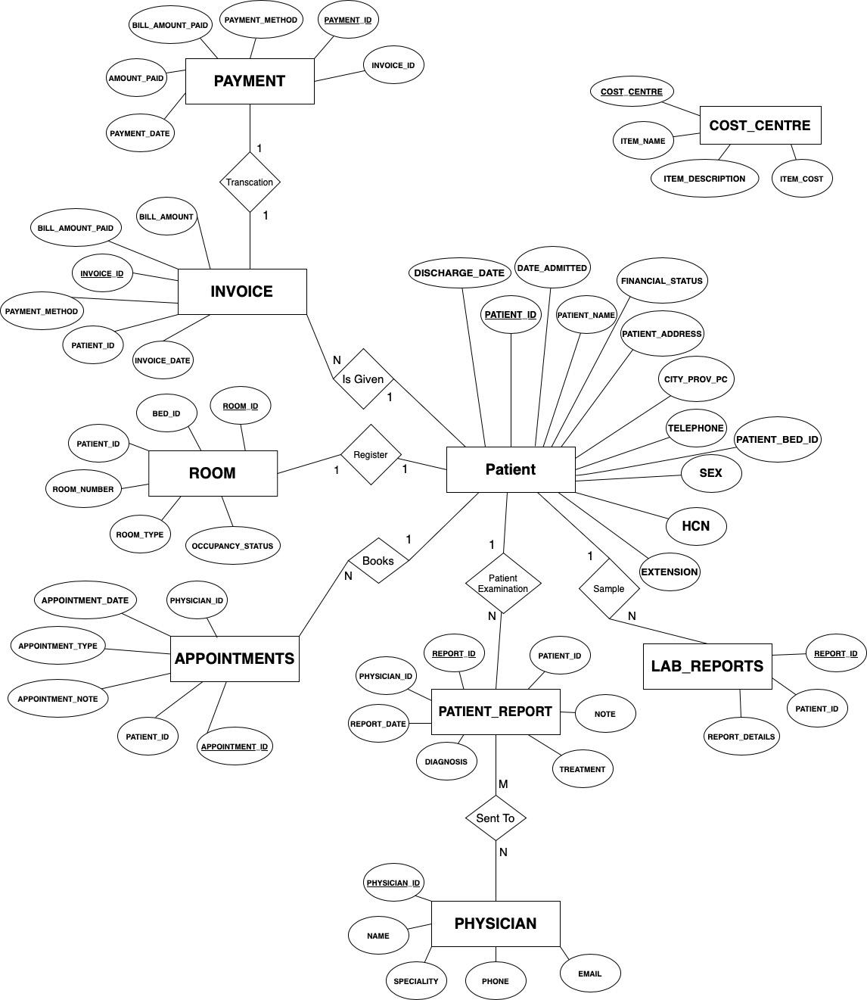

<h1>Hospital Data Management System </h1>

Hospital data Management software using MySQL Workbench, PHP and SQL

<h3>Running the project on your Machine</h3>
1. Make sure you have all the files required 
2. Make sure you have downloaded and installed xampp on your machine. Link to download xampp - https://www.apachefriends.org/download.html
3. Run all the commands to create the database and to insert the data on your machine.
4. Make sure you change the username and password in all the .php files.
5. Run homepage.php and you are good to go!

<h3> Future Works </h3>

1. Developing a front-end for the project
2. Pre-defining tasks for user interface
3. Publish the database for everyone to access

<h3>Prerequistes</h3>

1. Install XAMPP Server
2. Any Editor (Preferably VS Code)
3. Install MYSQL Workbench

<h3>Laguages and technology Used</h3>

1. MySQL Workbench
2. CSS
3. PHP
4. XAMPP Server
5. HTML
6. Java Script
7. Bootstrap

<h3>Schema Diagram</h3>

<h3>ER Diagram</h3>

